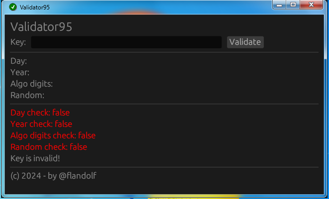

# 🔐 Windows 95 Key Validator

## Overview

The Windows 95 Key Validator is an eframe application written in Rust, designed to validate Windows 95 product keys. This application provides a user-friendly interface to validate keys and ensure their correctness.

## Features

- Validate Windows 95 product keys.
- Simple and intuitive user interface.
- Error messages for invalid keys.

## Installation

To use this application, download the executable file for your platform from the releases page on GitHub.

## Usage

Simply run the executable file to launch the Windows 95 Key Validator application. Enter the product key you want to validate in the provided input field and click the "Validate" button. The application will display a message indicating whether the key is valid or not.

## Screenshots

## Contributing

Contributions are welcome! If you encounter any issues or have suggestions for improvements, please open an issue or submit a pull request on [GitHub](https://github.com/flandolf/validator95).

## License

This project is licensed under the MIT License - see the [LICENSE](LICENSE) file for details.
